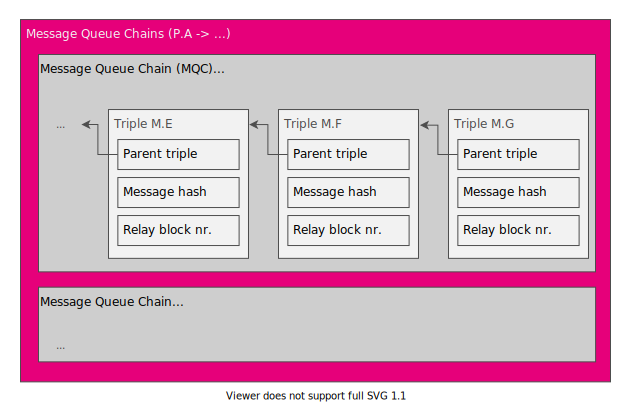

# Polkadot Message Passing

> [!!] Disclaimer: this document is work-in-progress and will change a lot until
> finalization.

## Overview

Polkadot implements two types of message passing mechanisms; vertical passing
and horizontal passing.

* Vertical message passing refers to the communication between the parachains
  and the relay chain. More precisely, when the relay chain sends messages to a
  parachain, it's "downward message passing". When a parachain sends messages to
  the relay chain, it's "upward message passing".

* Horizontal message passing refers to the communication between the parachains,
  only requiring minimal involvement of the relay chain. The relay chain
  essentially only stores proofs that message where sent and whether the
  recipient has read those messages.


## Message Queue Chain (MQC)

The Message Queue Chain (MQC) is a general hash chain construct created by
validators which keeps track of any messages sent from a sender to an individual
recipient. The MQC is used by both HRMP and XCMP.

Each block within the MQC is a triple containing the following fields:

`Triple:`
- `parent_hash`: The hash of the previous triple.
- `message_hash`: The hash of the message itself.
- `number`: The relay block number at which the message was sent.



A MQC is always specific to one channel. Additional channels require its own,
individual MQC. The MQC itself is not saved anywhere, but only provides a final
proof of all the received messages. When a validators receives a candidate, it
generates the MQC from the messages placed withing `upward_messages`, in
ascending order.

## HRMP

Polkadot currently implements the mechanism known as Horizontal Relay-routed
Message Passing (HRMP), which fully relies on vertical message passing in order
to communicate between parachains. Consequently, this goes against the entire
idea of horizontal passing in the first place, since now every message has to be
inserted into the relay chain itself, therefore heavily increasing footprint and
resource requirements. However, HRMP currently serves as a fast track to
implementing cross-chain interoperability. The upcoming replacement of HRMP is
Cross-Chain Message Passing (XCMP), which exchanges messages directly between
parachains and only updates proofs and read-confirmations on chain. With XCMP,
vertical message processing is only used for opening and closing channels.

### Channels

A channel is a construct on the relay chain indicating an open, one-directional
communication line between a sender and a recipient, including information about
how the channel is being used. The channel itself does not contain any messages.
A channel construct is created for each, individual communication line.

A channel contains the following fields:

`HrmpChannel`:

- `sender_deposit: int`: staked balances of sender.
- `recipient_deposit: int`: staked balances of recipient.
- `limit_used_places: int`: the maximum number of messages that can be pending
  in the channel at once.
- `limit_used_bytes: int`: the maximum total size of the messages that can be
  pending in the channel at once.
- `limit_message_size`: the maximum message size that could be put into the
  channel.
- `used_places: int`: number of messages used by the sender in this
  channel.
- `used_bytes: int`: total number of bytes used by the sender in this
  channel.
- `sealed: bool`: (TOOD: this is not defined in the Impl-Guide) indicator wether
  the channel is sealed. If it is, then the recipient will no longer
  accept any new messages.
- `mqc_head`: a head of the MQC for this channel.

This structure is created or overwritten on every start of each session.
Individual fields of this construct are updated for every message sent, such as
`used_places`, `used_bytes` and `mqc_head`. If the channel is sealed and
`used_places` reaches `0` (occurs when a new session begins), this construct is
be removed on the *next* session start.

The Runtime maintains a structure of the current, open channels in a map. The
key is a tuple of the sender ParaId and the recipient ParaId, where the value is
the corresponding `HrmpChannel` structure.

```
channels: map(ParaId, ParaId) => Channel
```

### Opening Channels

Polkadot places a certain limit on the amount of channels that can be opened
between parachains. Only the the sender can open a channel.

In order to open a channel, the sender must send an opening request
to the relay chain. The request is a construct containing the following fields:

`ChOpenRequest`:

- `sender: ParaId`: the ParaId of the sender.
- `recipient: ParaId`: the ParaId of the recipient.
- `confirmed: bool`: indicated whether the recipient has accepted the channel.
  On request creation, this value is `false`.
- `age: int`: the age of this request, which start at `0` and is incremented by
  1 on every session start.

TODO: Shouldn't `ChOpenRequest` also have an `initiator` field? Or can only the
sender open an channel?

#### Workflow

Before execution, the following conditions must be valid, otherwise the
candidate will be rejected.

* The `sender` and the `recipient` exist.
* `sender` is not the `recipient`.
* There's currently not a active channel established, either seal or unsealed
  (TODO: what if there's an active closing request pending?).
* There's not already an open channel request for `sender` and `recipient`
  pending.
* The caller of this function (`sender`) has capacity for a new channel. An open
  request counts towards the capacity (TODO: where is this defined?).
* The caller of this function (`sender`) has enough funds to cover the deposit.

The PVF executes the following steps:

* Create a `ChOpenRequest` message and inserts it into the `upward_messages`
  list of the candidate commitments.

Once the candidate is included in the relay chain, the runtime reads the
message from `upward_messages` and executes the following steps:

* Reads the message from `upward_messages` of the candidate commitments.
* Reserves a deposit for the caller of this function (`sender`) (TODO: how
  much?).
* Appends the `ChOpenRequest` request to the pending open request queue.

### Accepting Channels

Open channel requests must be accepted by the other parachain.

TODO: How does a Parachain decide which channels should be accepted? Probably
off-chain consensus/agreement?

The accept message contains the following fields:

`ChAccept`:
* `index: int`: the index of the open request list.

#### Workflow

Before execution, the following conditions must be valid, otherwise the
candidate will be rejected.

* The `index` is valid (the value is within range of the list).
* The `recipient` ParaId corresponds to the ParaId of the caller of this
  function.
* The caller of this function (`recipient`) has enough funds to cover the
  deposit.

The PVF executes the following steps:

* Generates a `ChAccept` message and inserts it into the
  `upward_messages` list of the candidate commitments.

Once the candidate is included in the relay chain, the relay runtime reads the
message from `upward_messages` and executes the following steps:

* Reserve a deposit for the caller of this function (`recipient`).
* Confirm the open channel request in the request list by setting the
  `confirmed` field to `true`.

### Closing Channels

Any open channel can be closed by the corresponding sender or receiver. No
mutual agreement is required. A close channel request is a construct containing
the following fields:

`ChCloseRequest`:

- `initiator: int`: the ParaId of the parachain which initiated this request,
  either the sender or the receiver.
- `sender: ParaId`: the ParaId of the sender.
- `recipient: ParaId`: the ParaId of the recipient.

### Workflow

Before execution, the following conditions must be valid, otherwise the
candidate will be rejected.

* There's currently and open channel or a pending open channel request between
  `sender` and `recipient`.
* The channel is not sealed.
* The caller of the Runtime function is either the `sender` or `recipient`.
* There is not existing close channel request.

The PVF executes the following steps:

* Generates a `ChCloseRequest` message and inserts it into the `upward_messages`
  list of the candidate commitments.

Once a candidate block is inserted into the relay chain, the relay runtime:

* Reads the message from `upward_message` of the candidate commitments.
* Appends the request `ChCloseRequest` to the pending close request queue.

### Sending messages

The Runtime treats messages as SCALE encoded byte arrays and has no concept or
understanding of the message type or format itself. Consensus on message format
must be established between the two communicating parachains (TODO: SPREE will handle this).

Messages intended to be read by other Parachains are inserted into
`horizontal_messages` of the candidate commitments (`CandidateCommitments`),
while message which are only intended to be read by the relay chain (such as
when opening, accepting or closing channels) are inserted into
`upward_messages`.

The messages are included by collators into the committed candidate receipt (),
which contains the following fields:

TODO: This should be defined somewhere else, ideally in a backing/validation
section (once this document is merged with AnV).

`CommittedCandidateReceipt`:

* `descriptor: CandidateDescriptor`: the descriptor of the candidate.
* `commitments: CandidateCommitments`: the commitments of the candidate receipt.

The candidate descriptor contains the following fields:

`CandidateDescriptor`:

* `para_id: ParaId`: the ID of the para this is a candidate for.
* `relay_parent: Hash`: the hash of the relay chain block this is executed in
  the context of.
* `collator: CollatorId`: the collator's SR25519 public key.
* `persisted_validation_data_hash: Hash`: the hash of the persisted valdation
  data. This is extra data derived from the relay chain state which may vary
  based on bitfields included before the candidate. Therefore, it cannot be
  derived entirely from the relay parent.
* `pov_hash: Hash`: the how of the PoV block.
* `signature: Signature`: the signature on the Blake2 256-bit hash of the
  following components of this receipt:
  * `para_id`
  * `relay_parent`
  * `persisted_validation_data_hash`
  * `pov_hash`

The candidate commitments contains the following fields:

`CandidateCommitments`:

* `fees: int`: fees paid from the chain to the relay chian validators
* `horizontal_message: [Message]`: a SCALE encoded arrary containing the
  messages intended to be received by the recipient parachain.
* `upward_messages: [Message]`: message destined to be interpreted by the relay
  chain itself.
* `erasure_root: Hash`: the root of a block's erasure encoding Merkle tree.
* `new_validation_code: Option<ValidationCode>`: new validation code for the
  parachain.
* `head_data: HeadData`: the head-data produced as a result of execution.
* `processed_downward_messages: u32`: the number of messages processed from the
  DMQ.
* `hrmp_watermark: BlockNumber`: the mark which specifies the block number up to
  which all inbound HRMP messages are processed.

### Receiving Messages

A recipient can check for unread messages by calling into the
`downward_messages` function of the relay runtime (TODO: currently it's not
really clear how a recipient will check for new messages).

Params:
- `id: ParaId`: the ParaId of the sender.

On success, it returns a SCALE encoded array of messages.

## XCMP

XCMP is a horizontal message passing mechanism of Polkadot which allows
Parachains to communicate with each other and to prove that messages have been
sent. A core principle is that the relay chain remains as thin as possible in
regards to messaging and only contains the required information for the validity
of message processing.


The entire XCMP process requires a couple of steps:

* The sender creates a local Message Queue Chain (MQC) of the
  messages it wants to send and inserts the Merkle root into a structure on the
  relay chain, known as the Channel State Table (CST).

* The messages are sent to the recipient and contain the necessary
  data in order to reproduce the MQC.

* The BIOS module of the recipient process those messages. The
  messages are then inserted into the next parablock body as inherent
  extrinsics.

* Once that parablock is inserted into the relay chain, the recipient
  then updates the Watermark, which points to the relay block number which
  includes the parablock. This serves as an indicator that the receiving
  parachain has processed messages up to that relay block.

Availabilty

* The messages created by the sender must be kept available for at
  least one day. When AnV assigns validators to check the validity of the
  sending parachains parablocks, it can load the data from the CST, which
  includes the information required in order to regenerate the MQC.

* ...

### CST: Channel State Table

The Channel State Table (CST) is a map construct on the relay chain which keeps
track of every MQC generated by a single sender. The corresponding value is a
list of pairs, where each pair contains the ParaId of the recipient, the Merkle
root of MQC heads and the relay block number where that item was last updated in
the CST. This provides a mechanism for receiving parachains to easily verify
messages sent from a specific source.

```
cst: map ParaId => [ChannelState]
```

`ChannelState`:

* `last_updated: BlockNumber`: the relay block number where the CST was last
  updated.
* `mqc_root: Option<Hash>`: The Merkle root of all MQC heads where the parachain
  is the sender. This item is `None` in case there is no prior message.

Besides the CST, there's also a CST Root, which is an additional map construct
and contains an entry for every sender and the corresponding Merkle
root of each `ChannelState` in the CST.

```
cst_roots: map ParaId => Hash
```

When a PoV block on the recipient is created, the collator which
builds that block fetches the pairs of the sender from the CST and
creates its own Merkle root. When that PoV block is sent to the validator, the
validator can just fetch the Merkle root from the CST Root and verify the PoV
block without requiring the full list of pairs.

### Message content

All messages sent to the recipient must contain enough information in
order for the recipient to verify those messages with the CST. This
includes the necessary Merkle trie nodes, the parent triple of each individual
MQC block and the messages themselves. The recipient then recreates
the MQC and verifies it against the CST.

### Watermark

Collators of the recipient insert the messages into their parablock as
Inherents and publish the parablock to the relay chain. Once included, the
watermark is updated and points to the relay chain block number where the
inclusion ocurred.

```
watermark: map ParaId => (BlockNumber, ParaId)
```

## SPREE

...
